# Building VPC, Subnet & IGW via AWS CLI & AWS

## Project Overview

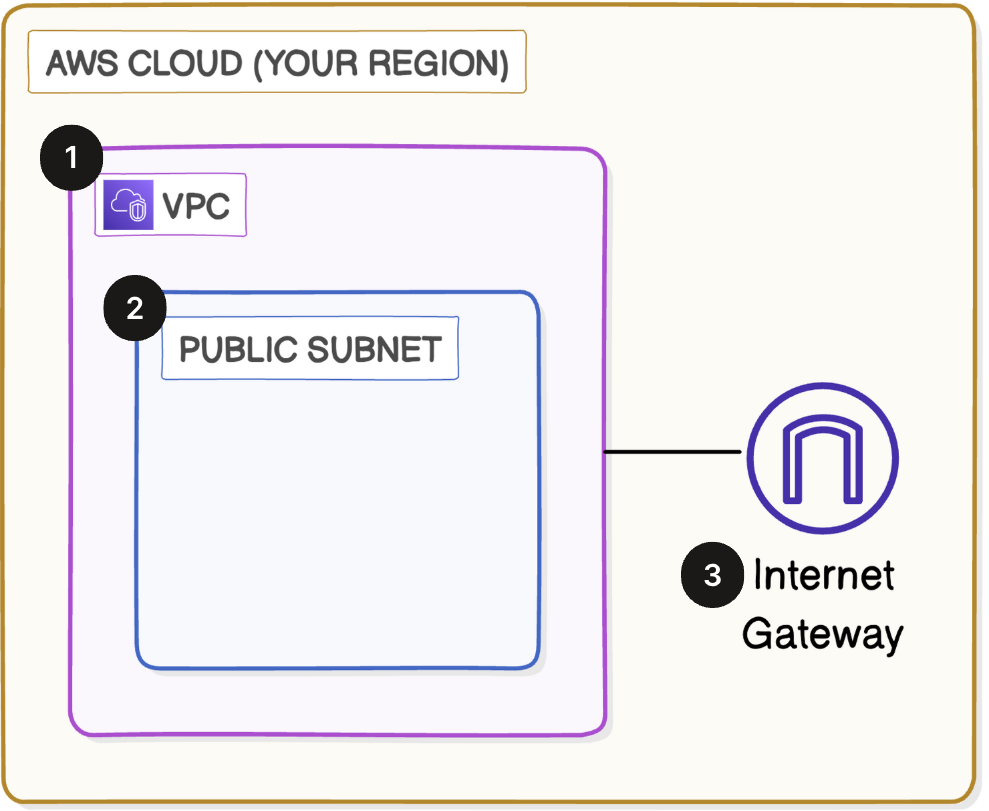

In this project I will setup a VPC, Subnet and IGW through AWS console and AWS CLI

## Create a VPC

### What I did in this step

Checked if I was in the right region (us-east-1)

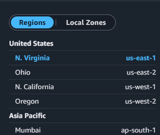

navigated to vpc dashboard

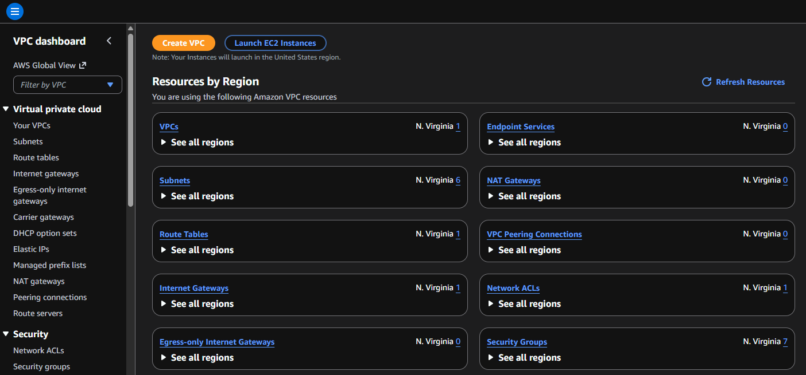

selected create vpc, filled out vpc details

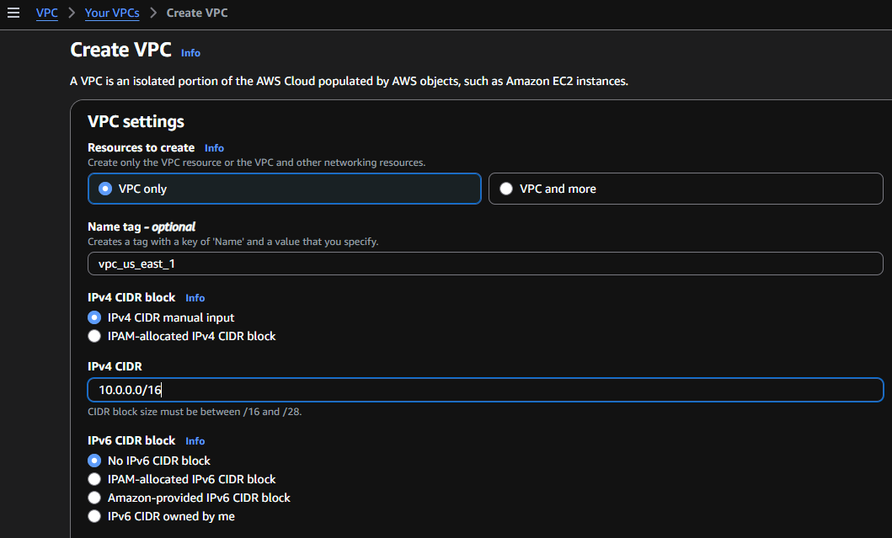

## Create Subnets

### What I did in this step

navigated to subnets

configured subnet settings

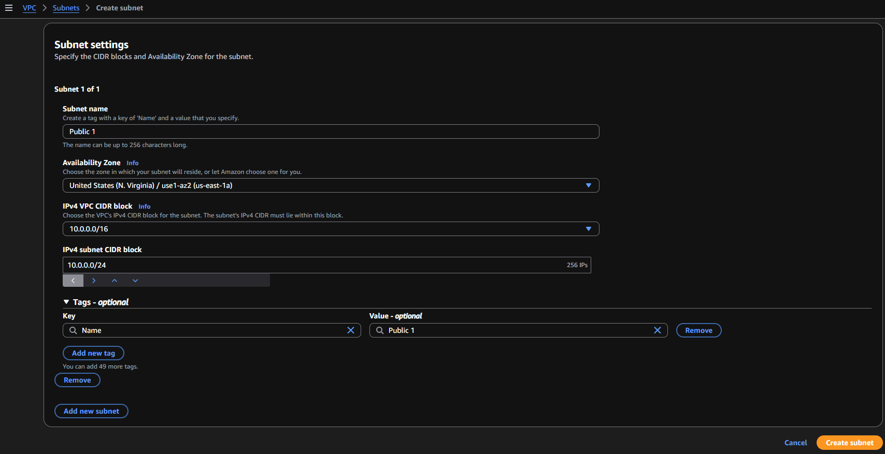

under edit subnet settings I enable auto-assign public Ipv4 address

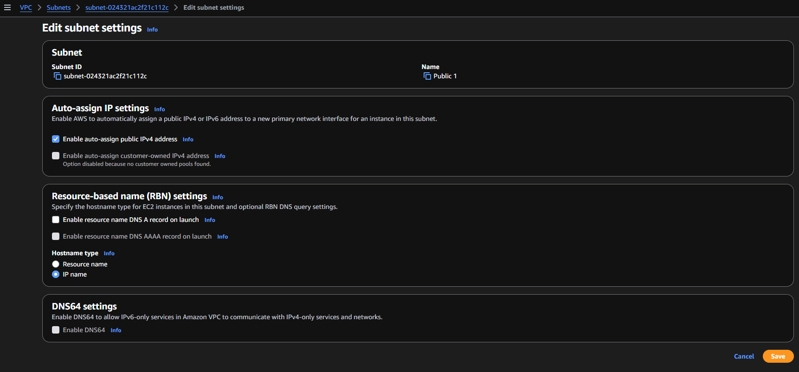

## Create an internet gateway

### What I did in this step

navigated to Internet gateways

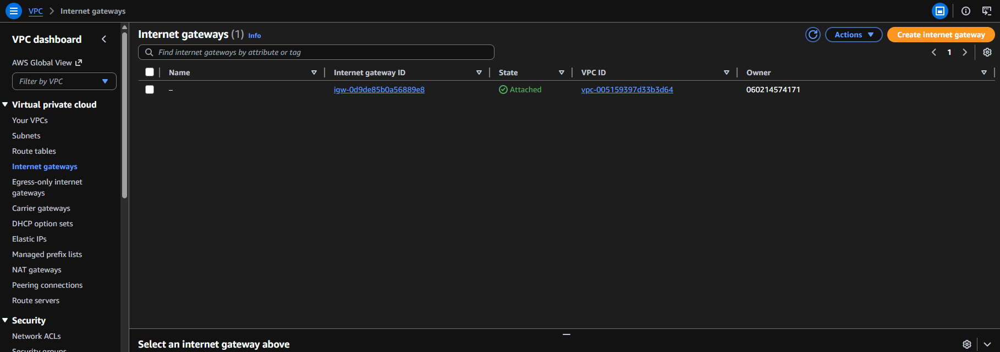

configured and created the Internet gateway

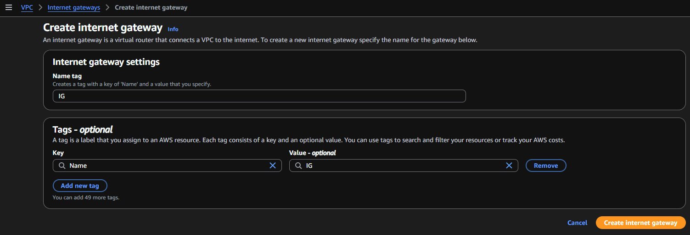

Attached the Internet gateway to the vpc I created

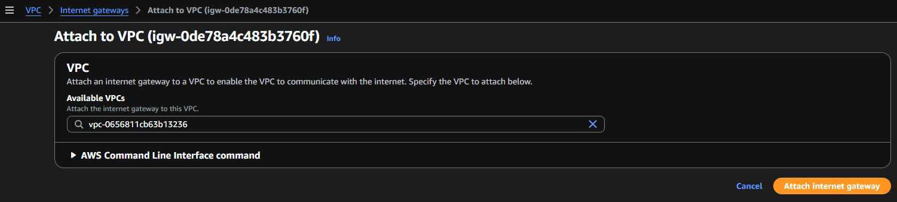

# Launching a VPC with AWS CLI

## In this section I will run AWS CLI commanads to set up a VPC, Subnet and Internet Gateway

### Create a VPC with AWS CLI, What I did in this step

ran the command (aws ec2 create-vpc --cidr-block 10.0.0.0/24 --query Vpc.VpcId --output text)
this will create a VPC with the CIDR block 10.0.0.0/24

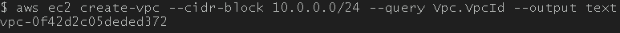

Break down of this command:

(aws ec2) tells the CLI we want to use the EC2 service.

(create-vpc) is the specific action I was doing, which is creating a new VPC.

(--cidr-block 10.0.0.0/24) sets up the CIDR block for the VPC I am creating.

(--query Vpc.VpcId --output text) asks the terminal to format its response as plain text and only show the VPC ID and none of the other data.

the vpc was created but with no name

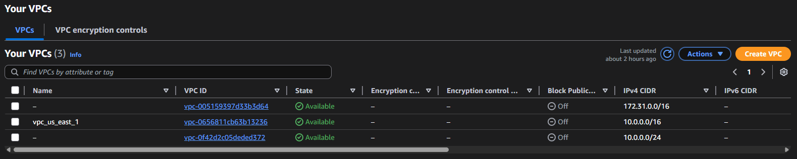

ran the command (aws ec2 create-tags --resources=vpc-0f42d2c05deded372 --tags Key=Name,Value="VPC 2")

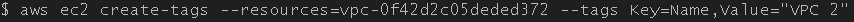

the vpc now has a name of VPC 2

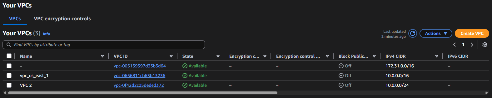

### Create a Subnet with AWS CLI, What I did in this step

ran the command (aws ec2 create-subnet --vpc-id vpc-0f42d2c05deded372) and received and error

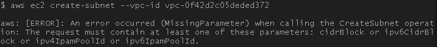

it was missing the parameter (--cidr-block)

added the missing parameter and ran the command with success

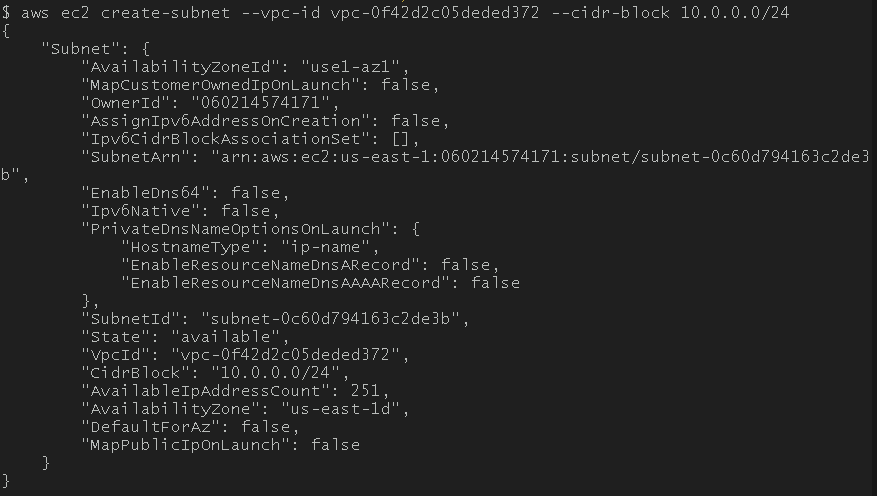

after selecting the vpc in the console under the resource map in the subnets panel shows the subnet and its CIDR block range that was created

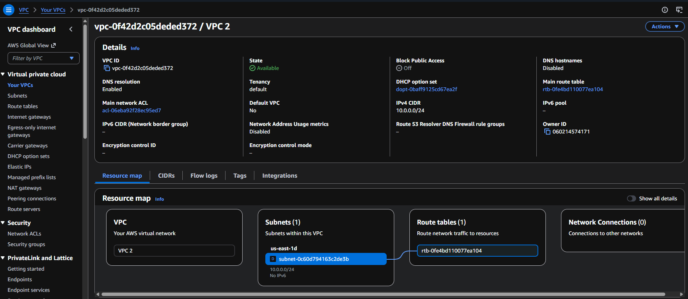

### Create a Internet Gateway with AWS CLI, What I did in this step

ran the command (aws ec2 create-internet-gateway --query InternetGateway.InternetGatewayId --output text) with the output of (igw-0b8a2d56be73fcd34)

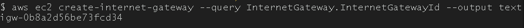

checking the console it shows its been created but not attached

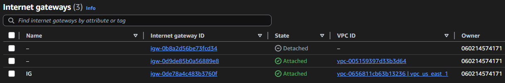

ran the command (aws ec2 attach-internet-gateway --vpc-id vpc-0f42d2c05deded372 --internet-gateway-id igw-0b8a2d56be73fcd34) with success, checking the console under Internet gateways it show the igw is attached to VPC 2

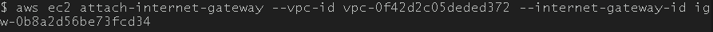

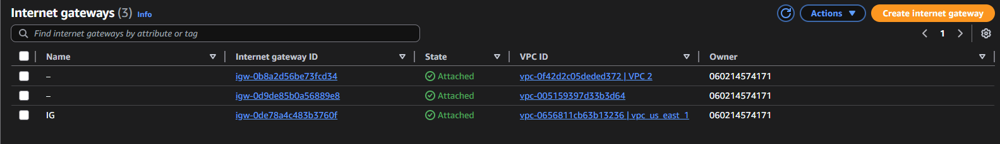
