# VPC Traffic Flow and Security

### Project Overview

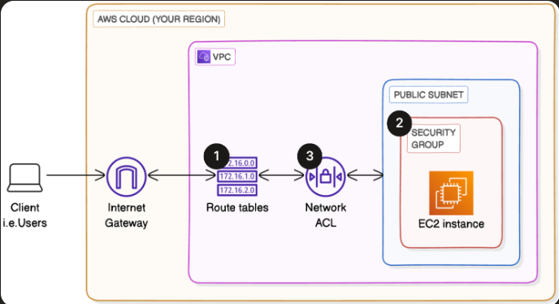

In this project, I will create a route table, associate it with a subnet, create a security group for users to access resources in the vpc, create a network acl connect it to a subnet all on AWS console. In AWS CLI I will create a vpc, internet gateway and a security group all in a different region. Then track all the resources across all regions with AWS Global View.

### Tools, Services and Concepts

Services - vpc, network acl, subnets, security groups, internet gateway, AWS Global View

Tools - AWS CLI

## Create a route table, What I did in this step

navigated to route table and named the route table for VPC 2

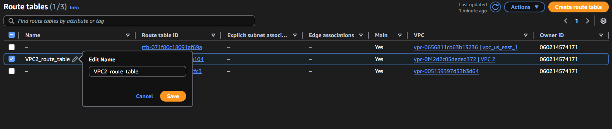

created a new route on the route table with a destination of 0.0.0.0/0 and a target of igw-0b8a2d56be73fcd34

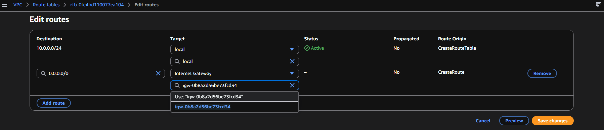

navigated to subnet associations, connected the subnet to the route table

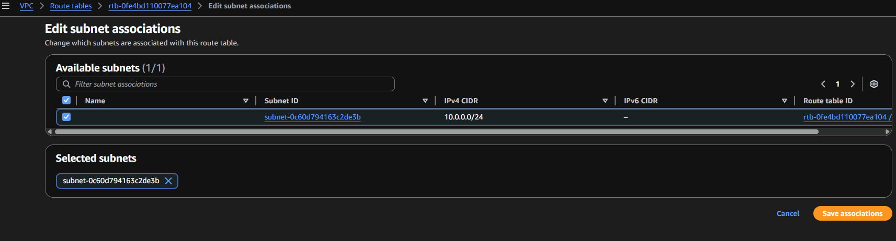

## Create a security group, What I did in this step

navigated to security groups, created and filled out security group details,

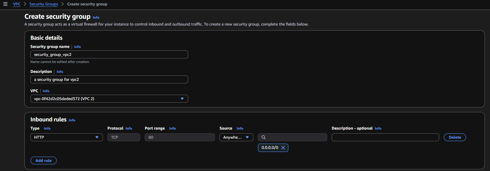

## Create a Network ACL, What I did in this step

navigated to network acl, created and filled out a new network acl

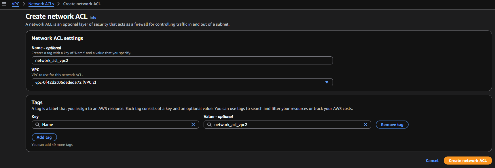

edited the new network acl(network_acl_vpc2) inbound rules

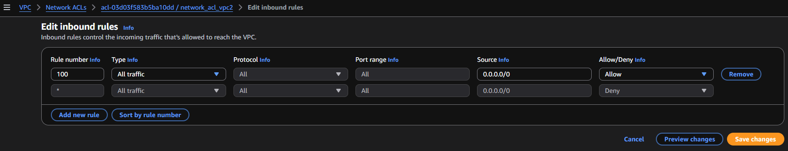

edited the new network acl(network_acl_vpc2) outbound rules

associated the subnet to the network acl

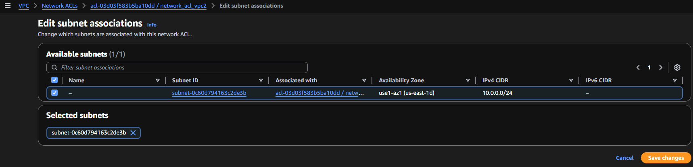

# Tracking VPC resources across regions

## In this section I will use AWS Global View to gather all VPC resources in an account across every region

### Create a VPC with AWS CLI, What I did in this step

ran the command (aws ec2 create-vpc --cidr-block 10.0.0.0/24 --query "Vpc.VpcId" --output text --tag-specifications 'ResourceType=vpc,Tags=[{Key=Name,Value=new-region-VPC}]' --region sa-east-1)

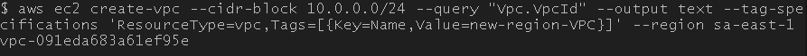

checking the console I saw new_region_vpc was created in the sa-east-1 region

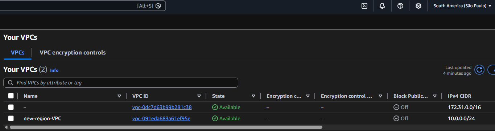

ran the command (aws ec2 create-internet-gateway --query "InternetGateway.InternetGatewayId" --output text --tag-specifications 'ResourceType=internet-gateway,Tags=[{Key=Name,Value="new-region-IG"}]' --region sa-east-1)

checking the console I saw new_region_IG was created in the sa-east-1 region

### Create a IGW with AWS CLI, What I did in this step

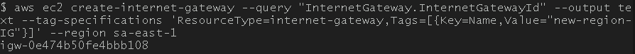

checking the console I saw new_region_sg was created in the sa-east-1 region

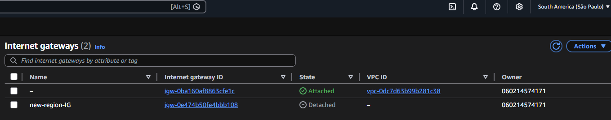

### Create a SG with AWS CLI, What I did in this step

ran the command (aws ec2 create-security-group --query "GroupId" --output text --description "New SG created to test creating an SG in another Region." --group-name new-region-sg --tag-specifications 'ResourceType=security-group,Tags=[{Key=Name,Value="new-region-sg"}]' --region sa-east-1)

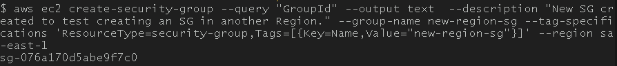

checking the console I saw new_region_sg was created in the sa-east-1 region

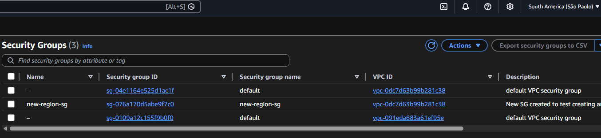

navigating to AWS Global View, I can see how may resources are in which region

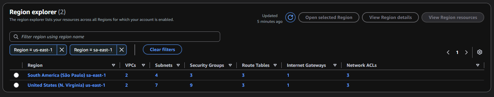