# Creating a Private Subnet

## Project Overview

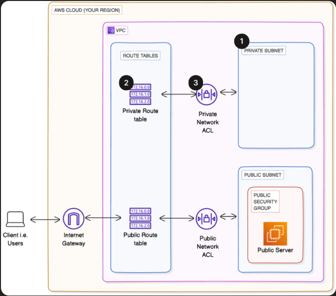

In this project, I will first recreate the previous resources from the first two networking projects with AWS CLI, including VPC, subnet, internet gateway, route table, security groups and network ACLs, one command at a time, showing the results in the AWS console and AWS CLI. From there I will continue to build a Private subnet, Private route table and Private network ACL in the AWS console.

## Technologies Used

### Cloud Services
- AWS VPC
- AWS Public and Private Subnets
- AWS IGW
- AWS Public and Private RTBs
- AWS SG
- AWS Public and Private NALCs

### Tools
- AWS CLI
- Git
- GitHub

### Skills Demonstrated
- Network Segmentation
- Cloud Infrastructure Management
- AWS Management Console

## Recreate and build on top of previous resources, What I did in this step
Repeating steps from the first two networking projects to set up VPC, subnet, internet gateway, route table, security group and network ACLs using AWS CLI.

Defined vpc, subnet, igw, route table and security group in git-bash. (I captured the network_acl in NACL_ID after AWS created it)

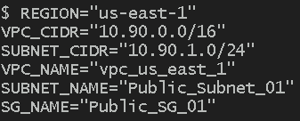

------------------------------
ran command:

VPC_ID=$(aws ec2 create-vpc \
    --cidr-block $VPC_CIDR \
    --query 'Vpc.VpcId' \
    --output text \
    --region $REGION)
    
echo "VPC Created: $VPC_ID"

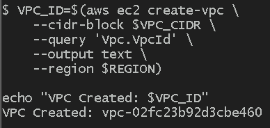

result: successful creation

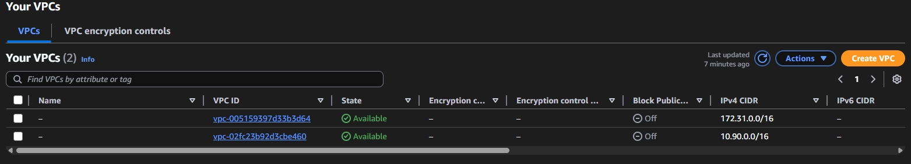

------------------------------
ran command:

aws ec2 create-tags \
    --resources $VPC_ID \
    --tags Key=Name,Value=$VPC_NAME \
    --region $REGION

result: successful creation of vpc tags

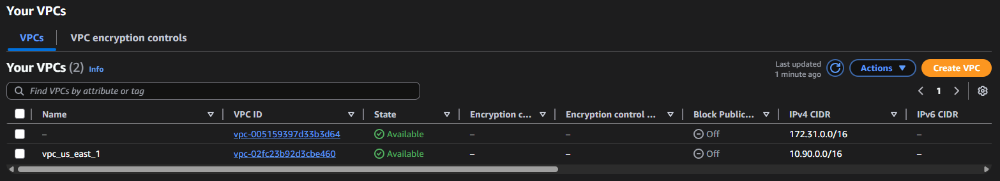

------------------------------
ran command:

SUBNET_ID=$(aws ec2 create-subnet \
    --vpc-id $VPC_ID \
    --cidr-block $SUBNET_CIDR \
    --query 'Subnet.SubnetId' \
    --output text \
    --region $REGION)

echo "Subnet Created: $SUBNET_ID"

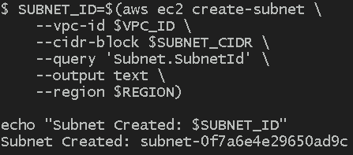

result: successful creation of subnet

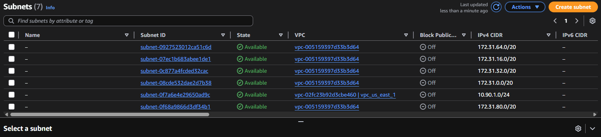
------------------------------
ran command:

aws ec2 create-tags \
    --resources $SUBNET_ID \
    --tags Key=Name,Value=$SUBNET_NAME \
    --region $REGION

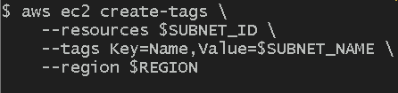

result: successful creation of subnet tags

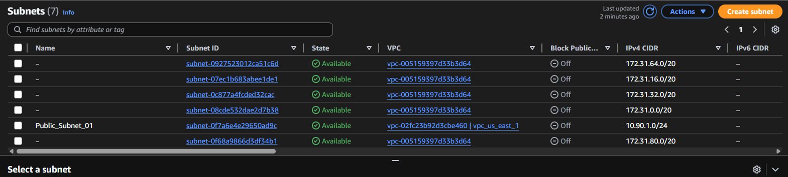
------------------------------
ran command:

IGW_ID=$(aws ec2 create-internet-gateway \
    --query 'InternetGateway.InternetGatewayId' \
    --output text \
    --region $REGION)

echo "IGW Created: $IGW_ID"

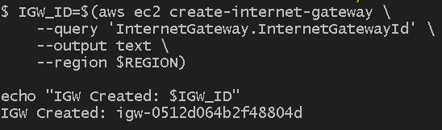

result: successful creation of IGW

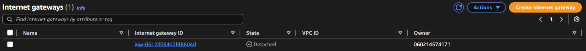

------------------------------
ran command:

aws ec2 attach-internet-gateway \
    --internet-gateway-id $IGW_ID \
    --vpc-id $VPC_ID \
    --region $REGION

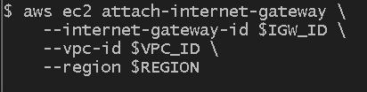

result: successfully attached IGW to the vpc

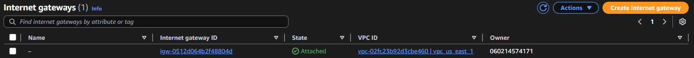

------------------------------
ran command:

RT_ID=$(aws ec2 create-route-table \
    --vpc-id $VPC_ID \
    --query 'RouteTable.RouteTableId' \
    --output text \
    --region $REGION)

echo "Route Table Created: $RT_ID"

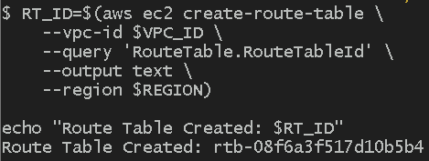

result: successful creation of rtb

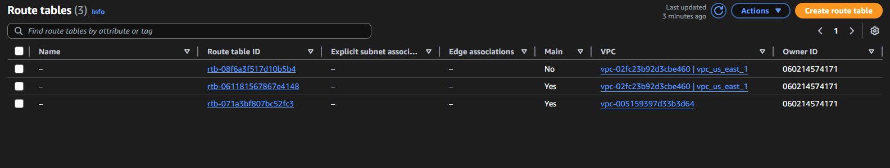

------------------------------
ran command:

aws ec2 create-route \
    --route-table-id $RT_ID \
    --destination-cidr-block 0.0.0.0/0 \
    --gateway-id $IGW_ID \
    --region $REGION

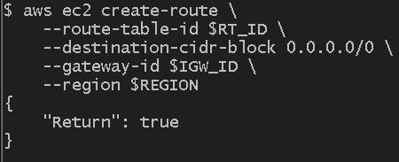

result: successful route creation of 0.0.0.0/0 destination

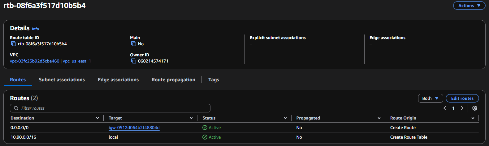

------------------------------
ran command:

aws ec2 associate-route-table \
    --subnet-id $SUBNET_ID \
    --route-table-id $RT_ID \
    --region $REGION

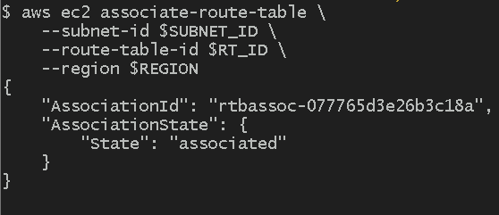

result: successfully associated the subnet with the route table

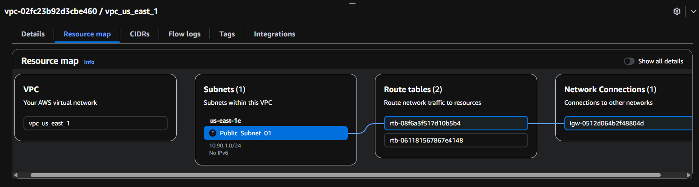

------------------------------
ran command:

SG_ID=$(aws ec2 create-security-group \
    --group-name $SG_NAME \
    --description "Web Security Group" \
    --vpc-id $VPC_ID \
    --query 'GroupId' \
    --output text \
    --region $REGION)

echo "Security Group Created: $SG_ID"

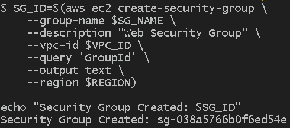

result: successful creation of SG

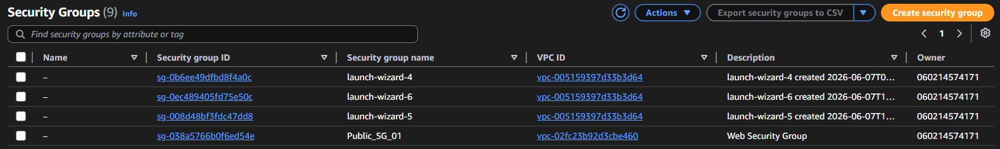

------------------------------
ran command:

aws ec2 authorize-security-group-ingress \
    --group-id $SG_ID \
    --protocol tcp \
    --port 80 \
    --cidr 0.0.0.0/0 \
    --region $REGION

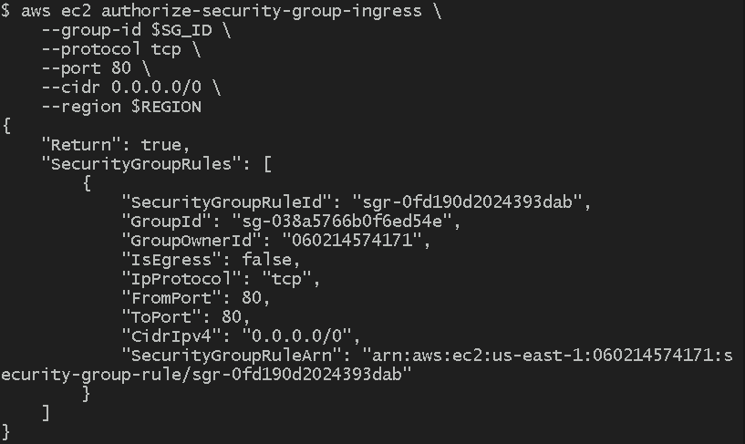

result: successfully added HTTP inbound rule to SG

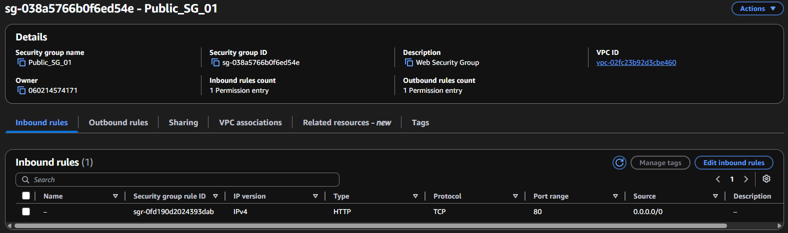

------------------------------
ran command:

NACL_ID=$(aws ec2 create-network-acl \
    --vpc-id $VPC_ID \
    --query 'NetworkAcl.NetworkAclId' \
    --output text \
    --region $REGION)

echo "Network ACL Created: $NACL_ID"

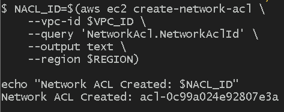

result: successful creation of NACL

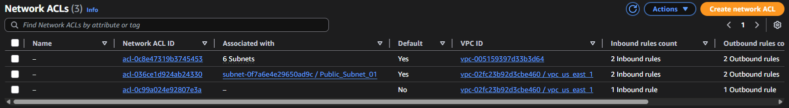

------------------------------
ran command:

aws ec2 create-network-acl-entry \
    --network-acl-id $NACL_ID \
    --rule-number 100 \
    --protocol tcp \
    --port-range From=80,To=80 \
    --rule-action allow \
    --cidr-block 0.0.0.0/0 \
    --ingress \
    --region $REGION

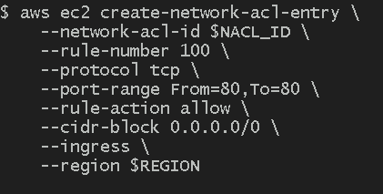

result: successfully created HTTP inbound rule on port 80

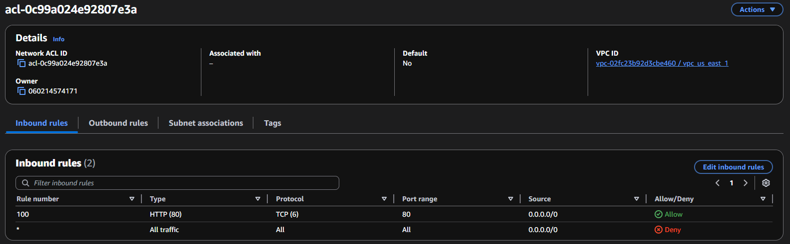

------------------------------
## Set up a private subnet, What I did in this step
navigated to subnet settings, created and filled out subnet details

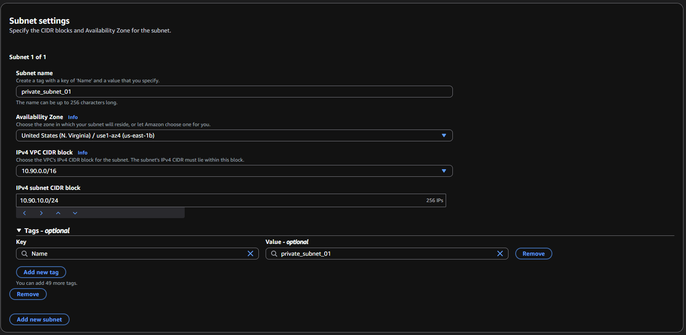

## Set up a private route table, What I did in this step
navigated to route table settings, created and filled out route table details

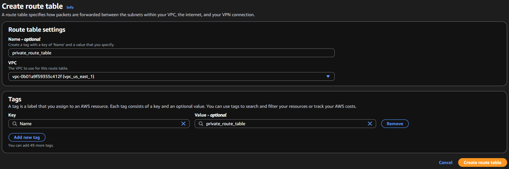

associated the route table with the private subnet

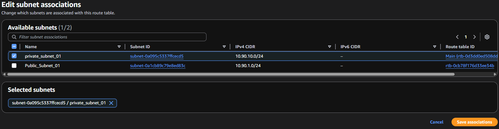

associated the private nacl with the private subnet

## Set up a private network ACL, What I did in this step
navigated to network acls, created and filled out private network acls details

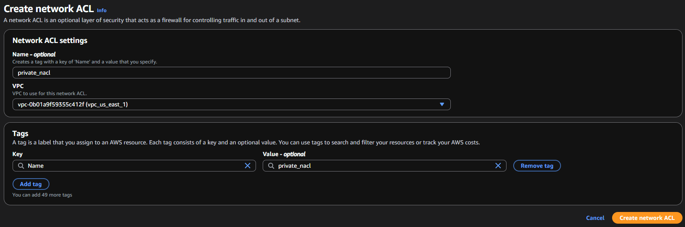
associated the private nacl with the private subnet

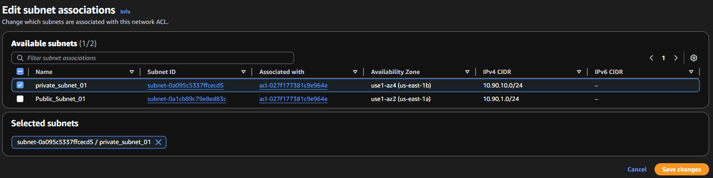

## End of project summary

Designed and implemented a multi-tier AWS networking environment by provisioning VPC infrastructure through the AWS CLI and AWS Management Console. Using CLI commands, I created and configured a VPC, public subnet, internet gateway, route tables, security groups, and network ACLs while validating resource creation through both the CLI and AWS Console.

To enhance network segmentation and security, I extended the architecture by creating a private subnet, private route table, and private network ACL. This project provided hands-on experience with AWS networking fundamentals, traffic routing, subnet isolation, access control, and infrastructure management through both automation and manual configuration methods.
