# Launching VPC Resources

## Project Overview

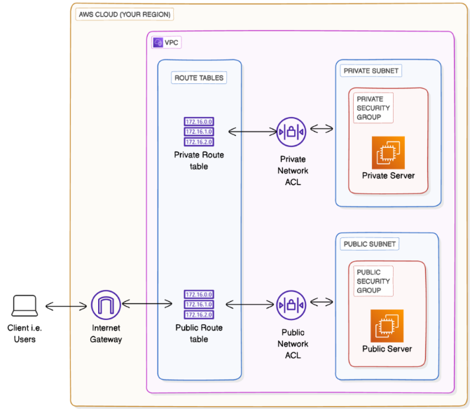

The first part of this project demonstrates how to build a secure AWS network infrastructure entirely through AWS CLI and Bash scripting. The goal was to automate network creation while learning AWS networking fundamentals and CLI automation. The second part I will create two EC2 instances one public the other private using the AWS console and place the public instance in the public subnet and the private instance in the private subnet.

## Technologies Used

### Cloud Services

- AWS VPC
- Subnet
- AWS IGW
- AWS RTBs
- Network ACL
- AWS Security Groups
- Amazon EC2

### Tools

- AWS CLI
- Git and GitHub
- VS Code
- AWS Management Console

### Skills Demonstrated

- Network Segmentation
- Infrastructure Automation
- Routing
- Access Control
- Bash Scripting
- Technical Documentation

### Troubleshooting Skills

- Validation in AWS Console
- Verification of associations
- Verification of routes
- Verification of NACLs
- Verification of Security Groups

## Screenshots

### Script Variables

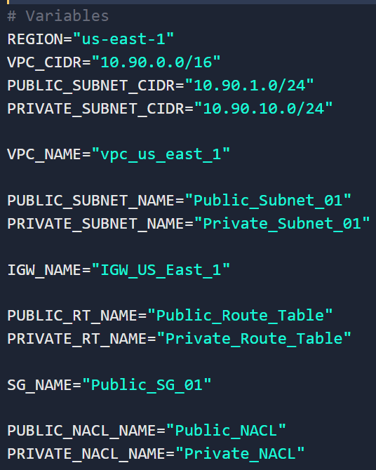

#### Bash Command: VPC_ID=$(aws ec2 create-vpc \

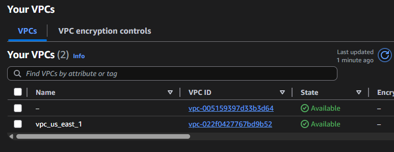

#### Bash Command: PUBLIC_SUBNET_ID=$(aws ec2 create-subnet \

#### Bash Command: PRIVATE_SUBNET_ID=$(aws ec2 create-subnet \

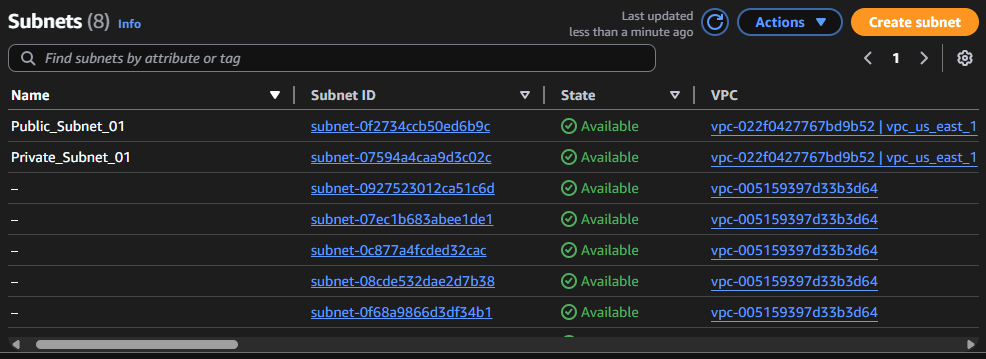

#### Bash Command: aws ec2 modify-subnet-attribute \

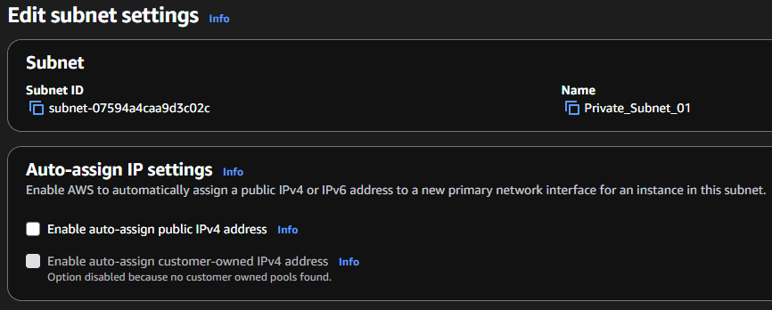

#### Bash Command: IGW_ID=$(aws ec2 create-internet-gateway \

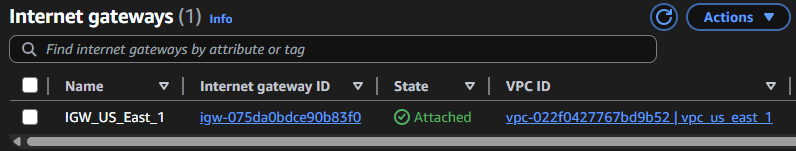

#### Bash Command: aws ec2 attach-internet-gateway \

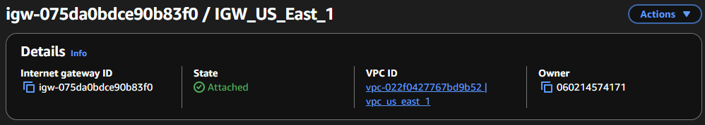

#### Bash Command: Public_RT_ID=$(aws ec2 create-route-table \

#### Bash Command: PRIVATE_RT_ID=$(aws ec2 create-route-table \

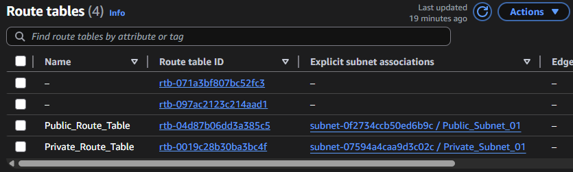

#### Bash Command: aws ec2 create-route \

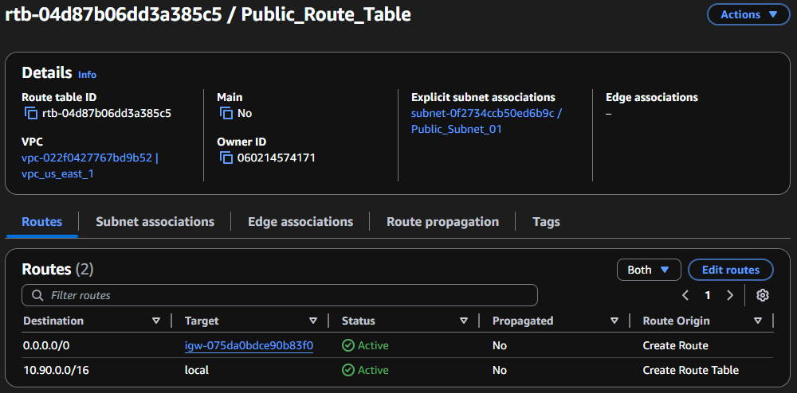

#### Bash Command: aws ec2 associate-route-table \

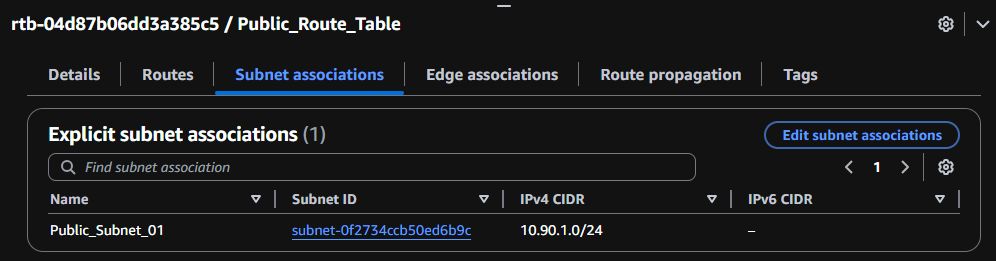

#### Bash Command:aws ec2 associate-route-table \

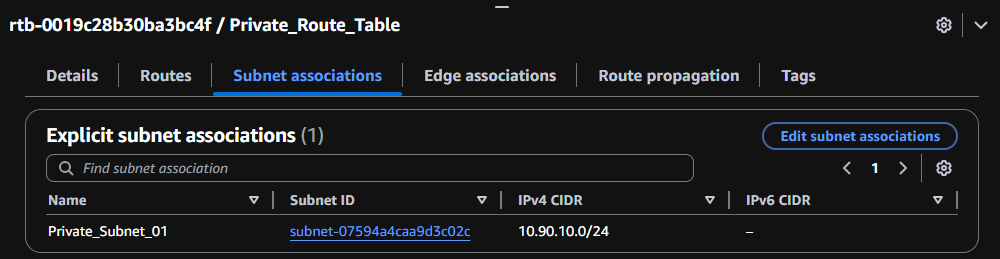

#### Bash Command: SG_ID=$(aws ec2 create-security-group \

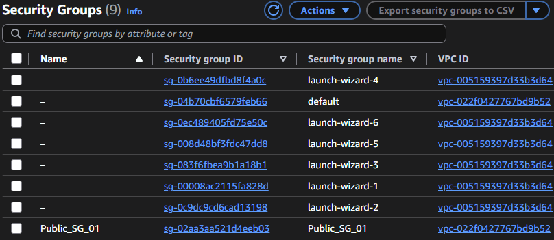

#### Bash Command: aws ec2 authorize-security-group-ingress \

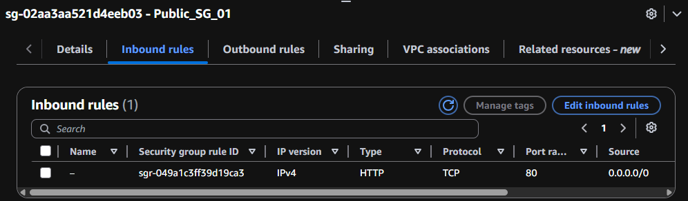

#### Bash Command: Public_NACL_ID=$(aws ec2 create-network-acl \

#### Bash Command: PRIVATE_NACL_ID=$(aws ec2 create-network-acl \

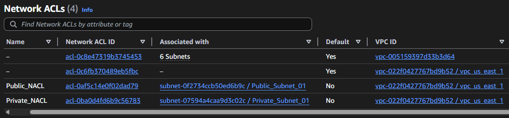

#### Bash Command: PUBLIC_NACL_ASSOC_ID=$(aws ec2 describe-network-acls \

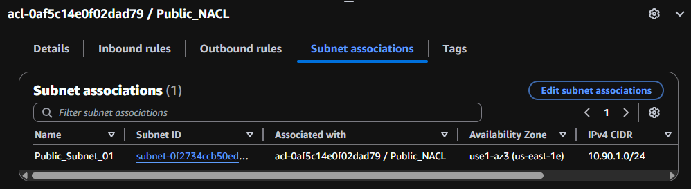

#### Bash Command: aws ec2 create-network-acl-entry \

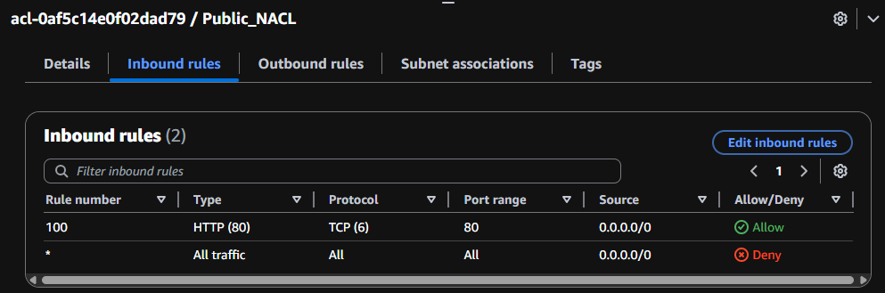

#### Bash Command:aws ec2 create-network-acl-entry \

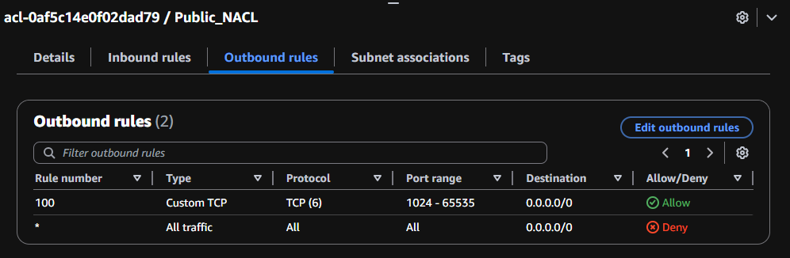

#### Bash Command: PRIVATE_NACL_ASSOC_ID=$(aws ec2 describe-network-acls \

#### Bash Command: aws ec2 replace-network-acl-association \

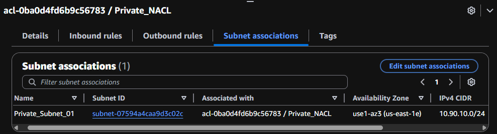

#### Bash Command: aws ec2 create-network-acl-entry \

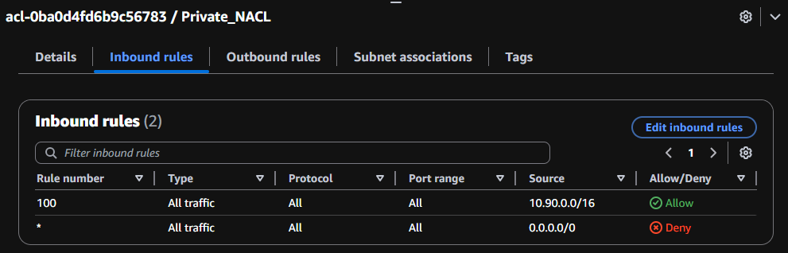

#### Bash Command:aws ec2 create-network-acl-entry \

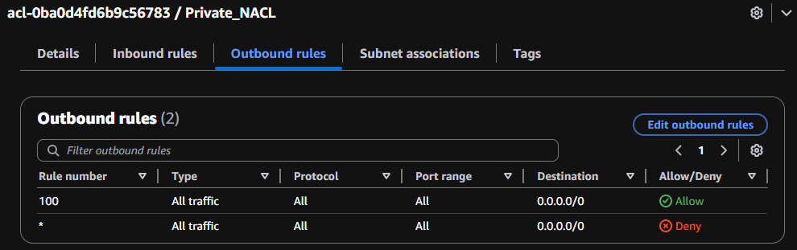

#### AWS Console: public ec2(name and ami)

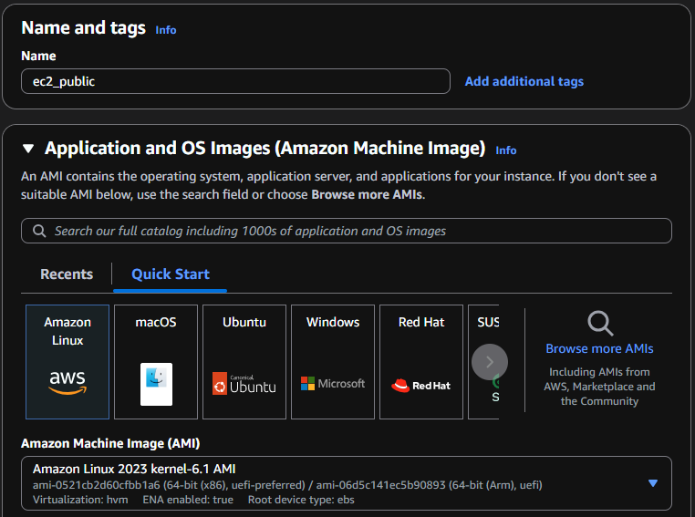

#### AWS Console: public ec2(instance_type and key_pair)

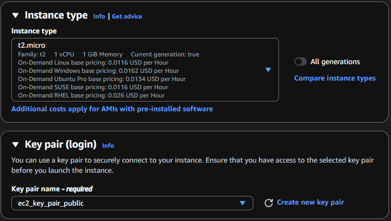

#### AWS Console: public ec2(network_settings)

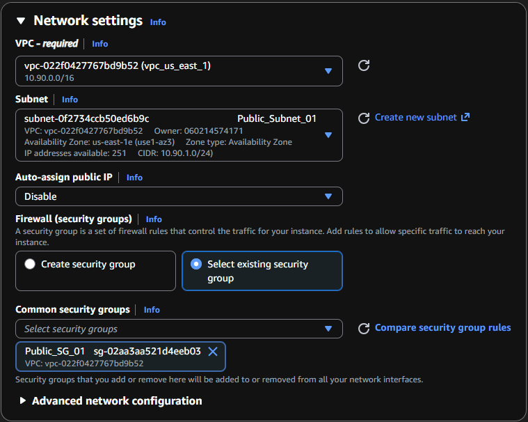

#### AWS Console: private ec2(name and ami)

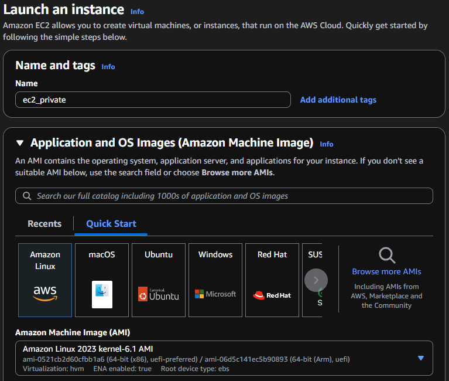

#### AWS Console: private ec2(instance_type and key_pair)

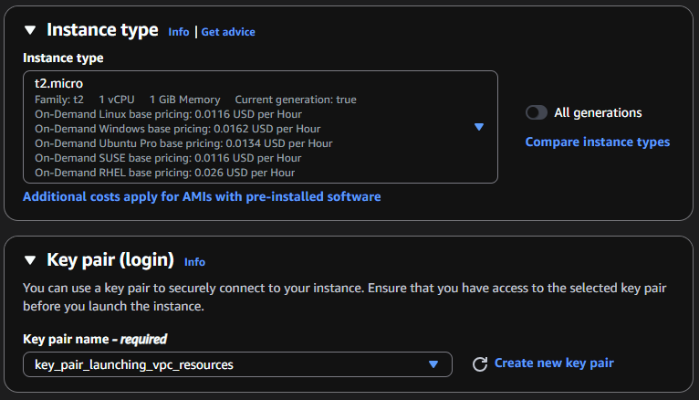

#### AWS Console: private ec2(network_settings)

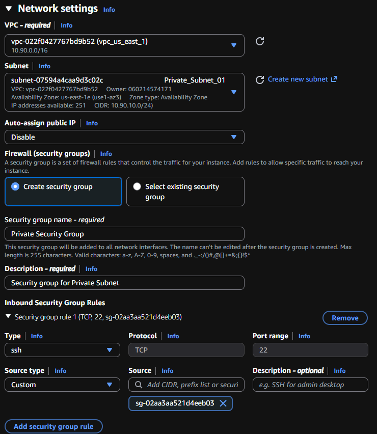

#### AWS Console: created ec2 instances

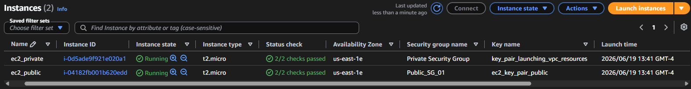

## Full Source Code

The complete deployment script is available here:

[vpc-us-east-1.sh](scripts/vpc-us-east-1.sh)
