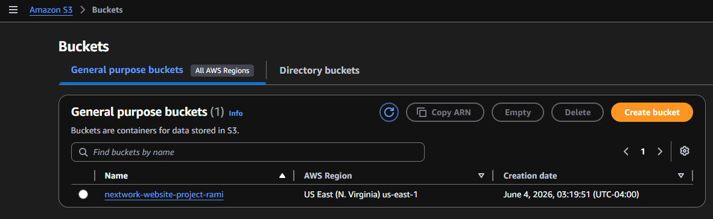
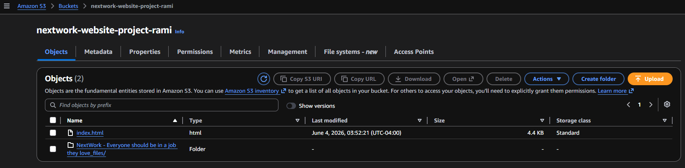
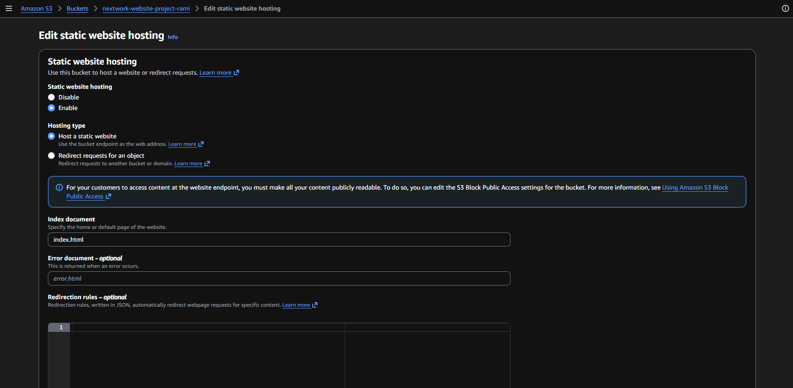
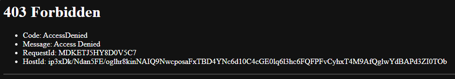
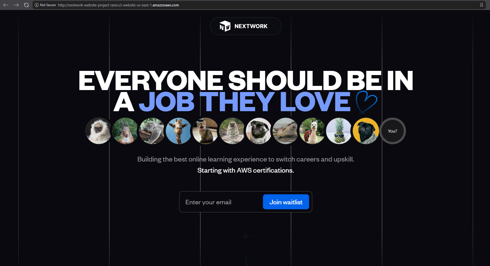
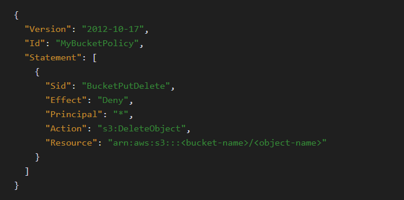
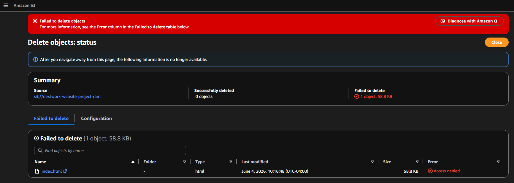

# Hosting a Website on Amazon S3

## Project overview

In this project, I will demonstrate how to host a website on Amazon S3, I'm doing this project to better understand Amazon S3.

### Tools, services and concepts

Services I used were Amazon S3, bucket policies and ACL. Key concept I learned bucket policies must be syntactically correct or it will throw an error with no guidance to fix it.

### Time, challenges, and insight

This project took me approximately 35 minutes. The most challenging part was getting the website to display after I made the ACL public. Learning each line of code within the bucket policy gave me a lot of insight of how granular you can make rules for your buckets.

---

## How to Set Up an S3 Bucket

### What I did in this step

In this step, I will open Amazon S3 and create a storage space for the websites' files

### How long it took to create the bucket

Creating an S3 bucket took about 5 minutes

### Region selection

The Region I picked for my S3 bucket was us-east-1 simply because its the closest to me

### Understanding bucket name uniqueness

S3 bucket names are globally unique! This means no other AWS account in the entire world can use your bucket's name.

---

## Upload Website Files to S3

### What I did in this step

In this step, I will Download an HTML file that sets up the website, Download a zip file of images for the website and Upload both files into the S3 bucket

### Files I uploaded

I uploaded one file and one folder to my S3 bucket - the index.html file and the NextWork .unzipped folder

### How the files work together

Both files are necessary for this project as HTML (HyperText Markup Language) is used to create and design web pages. It's a way of telling the website where you want to display your text, images, videos and more. HTML is the blueprint that shapes what you see when you visit a website. The zip folder has the pictures and files needed that make up the website.

---

## Static Website Hosting on S3

### What I did in this step

In this step, I will configure the S3 bucket for static website hosting and test the public website link.

### Understanding website hosting

Website hosting is what makes your website public on the internet. Website hosting = storing your HTML file (and the other files for your website) on a web server, so it's accessible online. Therefore configuring the S3 bucket for hosting, we're telling this bucket: "please create a URL that will take anyone to a page that displays the HTML file I just uploaded."

### How I enabled website hosting

To enable website hosting with the S3 bucket, I the bucket I uploaded the file and folder to, selected the properties tab, clicked edit on static website hosting panel, enabled static website hosting, chose host a static website for hosting type and entered index.html

### Access Control Lists (ACLs)

ACL is a set of rules that decides who can get access to a resource, that I enabled to manage access for each object in the bucket instead of using bucket policies which sets access or denies access for the entire bucket or a subset of objects and can manage who can delete, change and upload new objects to the bucket.

---

## Bucket Endpoints

### Understanding bucket endpoint URLs

Once static website is enabled, S3 produces a bucket endpoint URL, which is just like a regular website URL, letting people visit your S3 bucket's files as a website.

### What I saw when I tested the endpoint

When I first visited the bucket endpoint URL, I saw an 403 forbidden error. Anyone who reaches the site can see the bucket but not the contents. The reason for this error, the files are still private.

---

## Success

### What I did in this step

In this step, I will make the website files in s3 publicly accessible to fix the 403 error.

### How I resolved the 403 error

To resolve the 403 Forbidden error, I made the files public using the ACL. First I navigated to general purpose buckets, then selected the bucket I uploaded the files to, selected the index.html file and the folder I uploaded, clicked on actions tab and selected the option to make public using ACL. On the next page I clicked make public option and refreshed the page with the 403 error. Leading to all the files being loaded correctly on the webpage.

---

## Bucket Policies

### What I did

I set up a bucket policy that stops people from deleting the index.html file. I'm doing this to simply practice with bucket policies

### Understanding bucket policies

An alternative to ACLs are bucket policies, which is a resource-based AWS IAM policy used to grant or restrict access permissions to the Amazon S3 bucket and the objects within it The benefit of using bucket policies is you can manage who can delete, change and upload new objects to the bucket while ACLs are useful for setting rules that decides who can get access to a resource.

### Line by line break down of this policy

"Version": "2012-10-17" is the policy language version, which tells AWS you're using their 2012 standard for writing JSON policy code. This is the latest version and hasn't been updated since 2012

"Id": "MyBucketPolicy" is an ID for your policy. It’s how you can search for your policy in your AWS Management Console in the future.

"Statement": is an entire section of your policy code that outlines all the permissions it'll allow or deny. Each of those rules is called a statement that goes inside this section.

"Sid": "BucketPutDelete" is a specific ID for the one and only statement in your policy.

"Effect": "Deny" is where you specify that this rule will be denying certain actions.

"Principal": "*" means this deny rule applies to everyone. No exceptions!

"Action": "s3:DeleteObject" means the action you're denying is the ability to delete an object in S3. But it's not every object that you can no longer delete...

"Resource": "arn:aws:s3:::bucket-name/object-name" points out exactly which files no one can delete.

### What does the bucket policy do

This bucket policy blocks anyone who tries to delete it, I tested this by trying to delete the index.html file and received a failed to delete objects error.

### End of project summary

I chose to do this project because just having a certification is not enough to be trusted with a companies production account, building projects with services companies use in the same process irons out mistakes engineers would have made on the job.