# Cloud Security with AWS IAM

### Project Overview

In this project, I will launch two EC2 instances one for production and one for development, then control who has access to it by creating a IAM policy and attaching it to a user group, create a user with IAM user, place that user in the user_group and test IAM access for that user. I'm doing this project to learn more about EC2 instances, IAM policies, tags, IAM Users and User Groups.

### Tools, Services and Concepts

Services I used EC2 instances, IAM policies, IAM Users and User Groups and tags
Key concept tags can not have any typos or the IAM policy will not work.

### Time, Challenges and Insight

This project took me approximately 60 mins The most challenging part was a typo on the dev tag, that lead to the IAM policy not working properly. Learning to double check your IAM policy matches with your tags exactly will save you time and headaches

## How to Launch an EC2

### What I did in this step

First I made sure I was in the right region

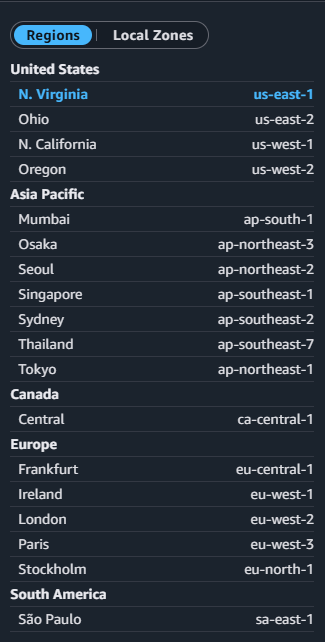

Navigated to EC2 console, Set up the two EC2s, one for production and one for development and did not create a key_pair (skipped network and storage setting, basic setup for this project)

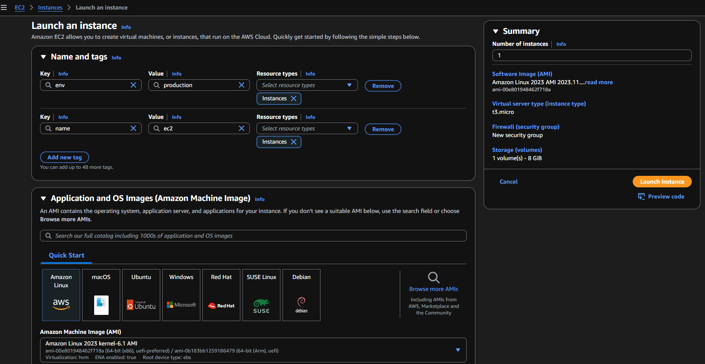

## Create an IAM Policy

### What I did in the step

I created an IAM policy that will give access to the development instance

First navigated to the IAM console

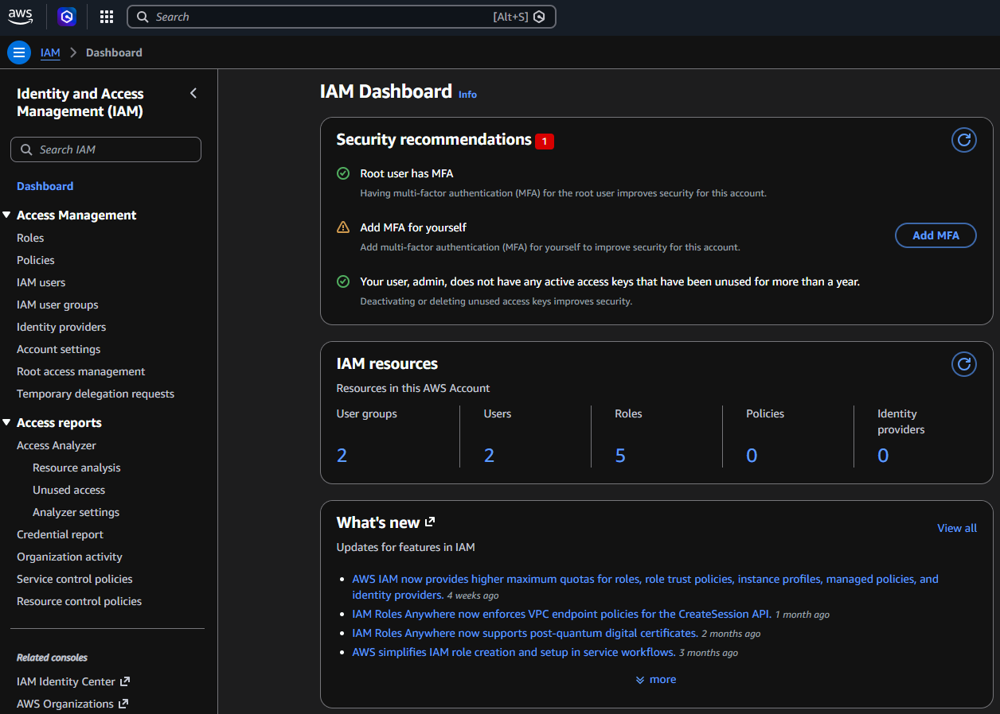

Chose policies from the left-hand panel

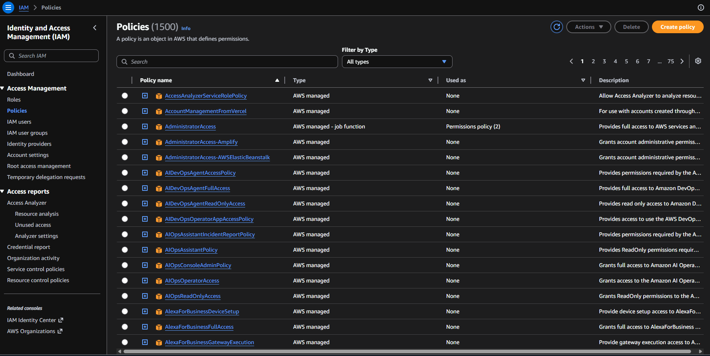

Created a policy and switched policy editor tab to JSON

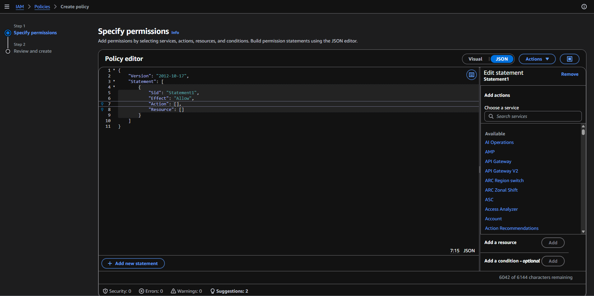

Replaced the default policy with my policy

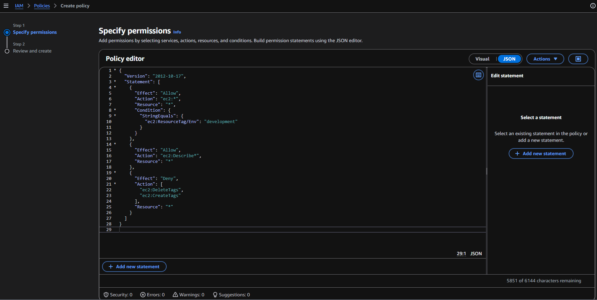

Filled out the policy's name and description

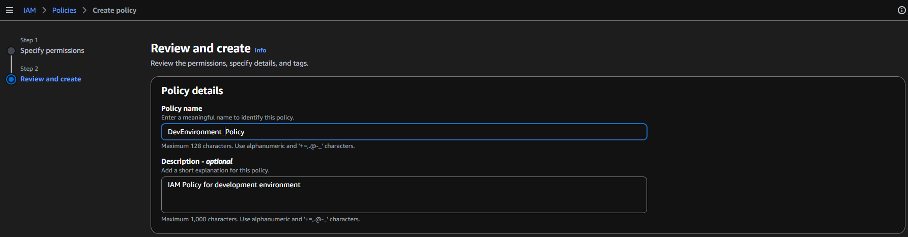

## Created an Account Alias

### What I did in this step

Created a new account alias

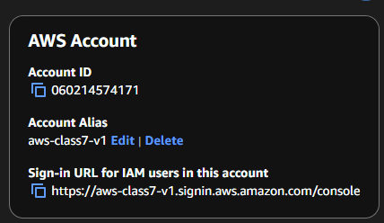

## IAM Users and User Groups

### What I did in this step

Navigated to user groups

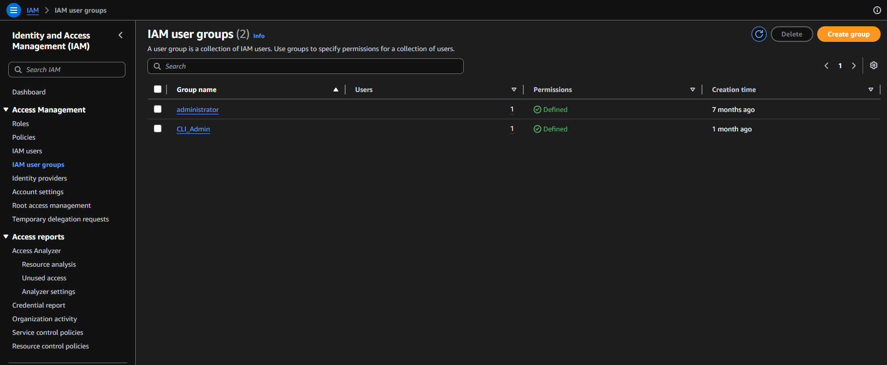

Created user group and attached a permissions policy

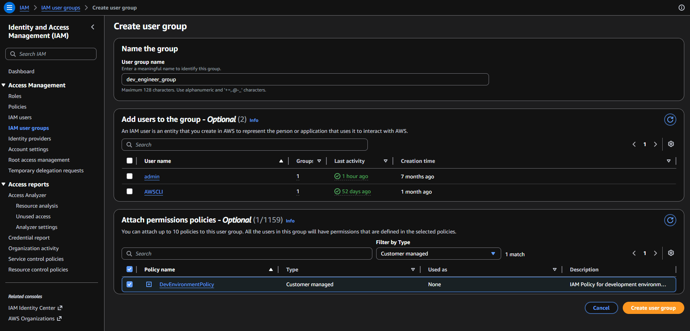

Navigated to IAM user, chose create user, filled out user details

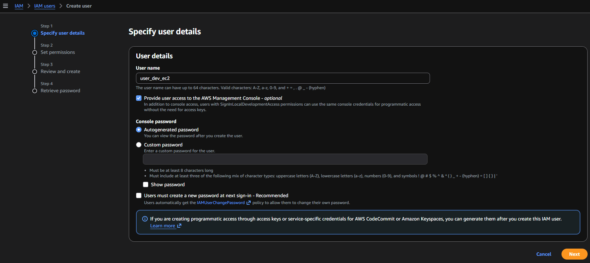

Set permissions for the user by adding them to the dev group

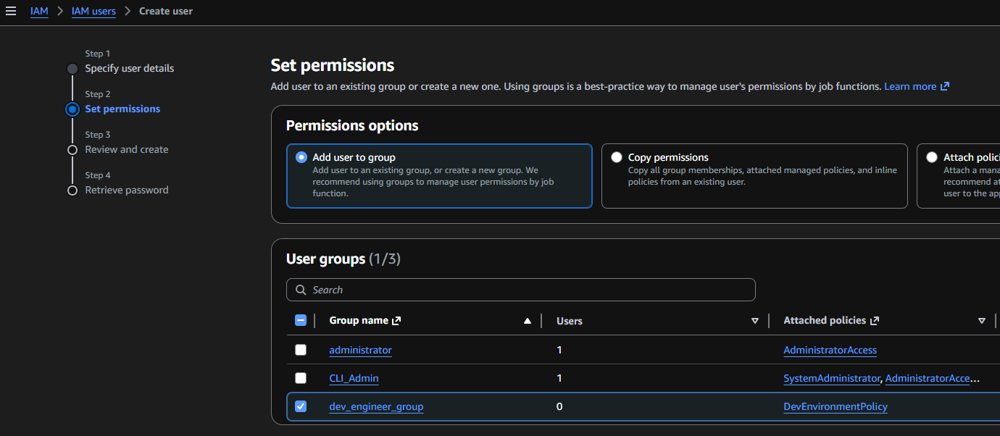

Successful creation of new user and console sign-in details

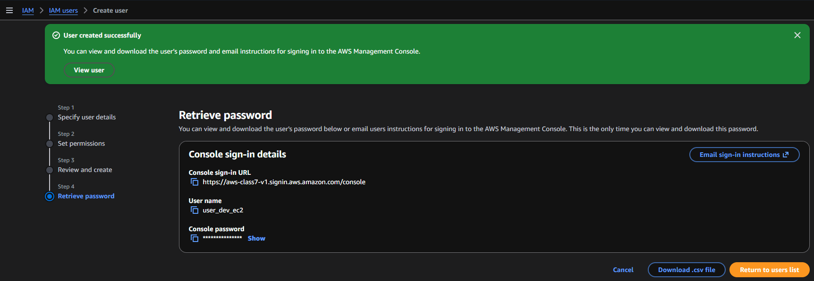

### Logging in as an IAM User

Successful user login with new user(user_dev_ec2)

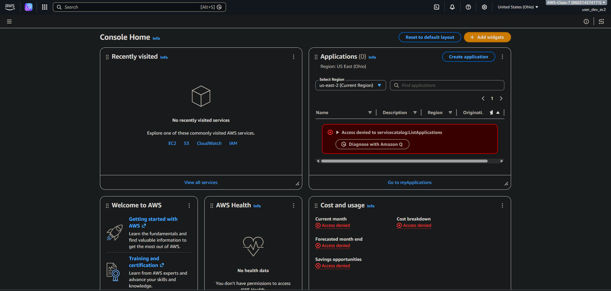

## Testing IAM Policies

### What I did in this step

Within user_dev_ec2 account changed region to us-east-1 (where the ec2 instances are deployed) and navigated to instances panel

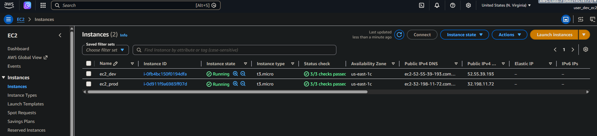

Selected the production instance and selected stop instance from the instance state dropdown.

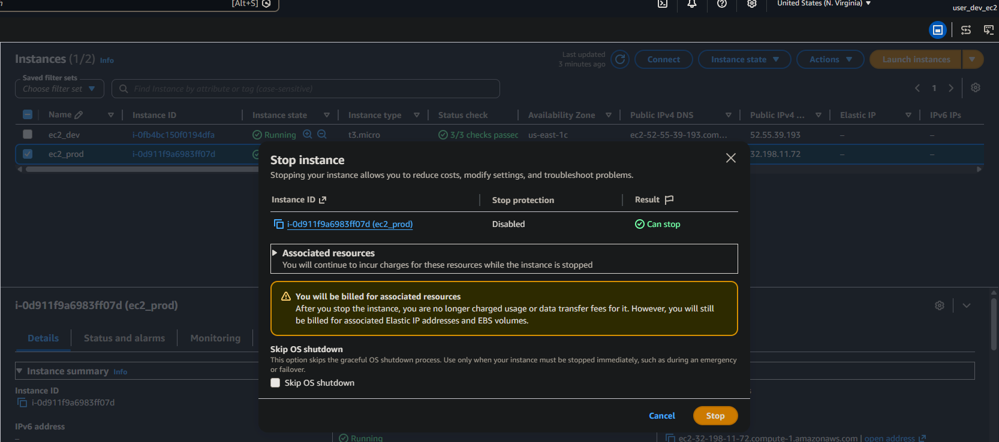

Received and error after trying to stop the prod ec2 stating (You are not authorized to perform this operation. User: arn:aws:iam::060214574171:user/user_dev_ec2 is not authorized to perform: ec2:StopInstances on resource: arn:aws:ec2:us-east-1:060214574171:instance/i-0d911f9a6983ff07d because no identity-based policy allows the ec2:StopInstances action.)

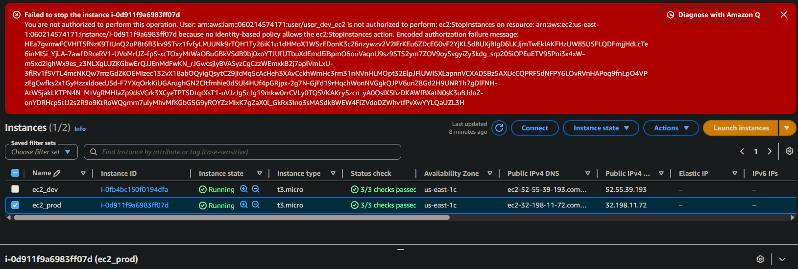

Selected the development instance and selected stop instance from the instance state dropdown.

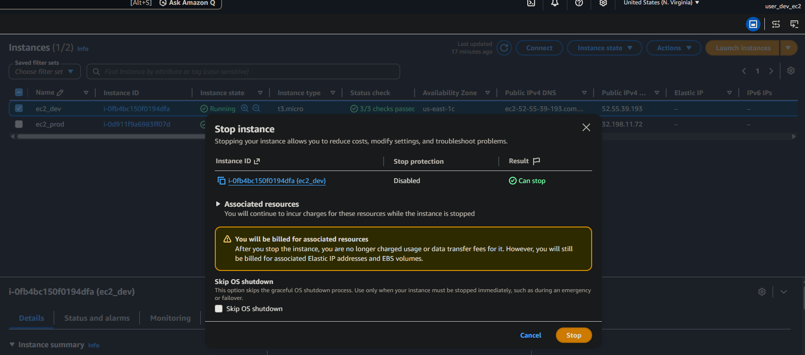

Successfully initiated stopping of ec2_dev with user_dev_ec2 account

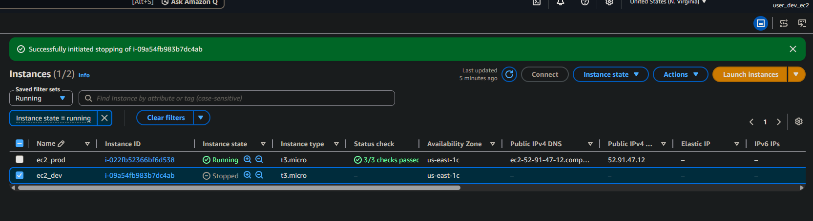

## IAM Policy Simulator

### How I used the simulator

Navigated to IAM dashboard, opened Policy simulator, selected dev_engineer_group, ec2, deletetags and stopinstaces, then ran simulation

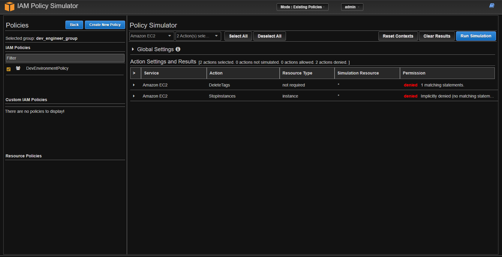

Expanded deletetags and selected show statement reviling exactly which statement in the policy is blocking the user from deleting tags

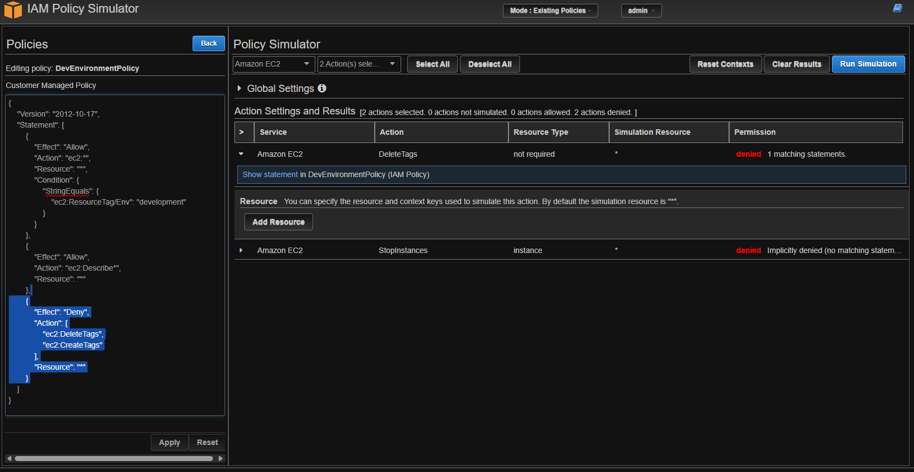

Noticed StopInstances is denied too and dev user_group can in fact stop the dev instances in their ec2 console. However The action was denied because the simulation resource is "*", meaning all resources. They can only stop ec2 instances with the env development tag but not all ec2 instances.

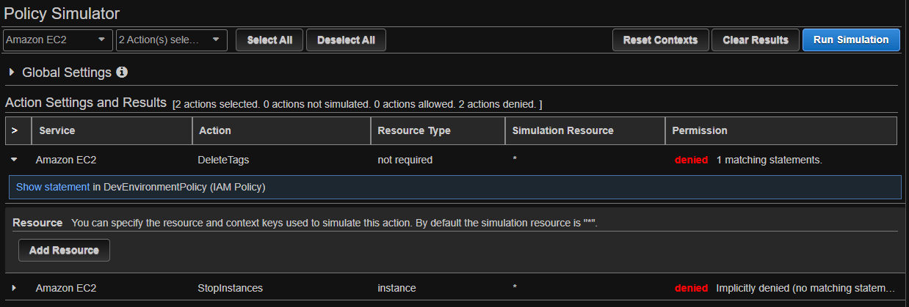

I set up a simulation again for dev_engineer_group, ec2, with two actions of deletetags and stopInstances. The results were permission denied for both. I had to adjust the simulation resource ec2:resourcetag/env to development to test the IAM group policy for the dev user_group. Policy Simulator now shows the dev group indeed has permission to stop instances with development tags.

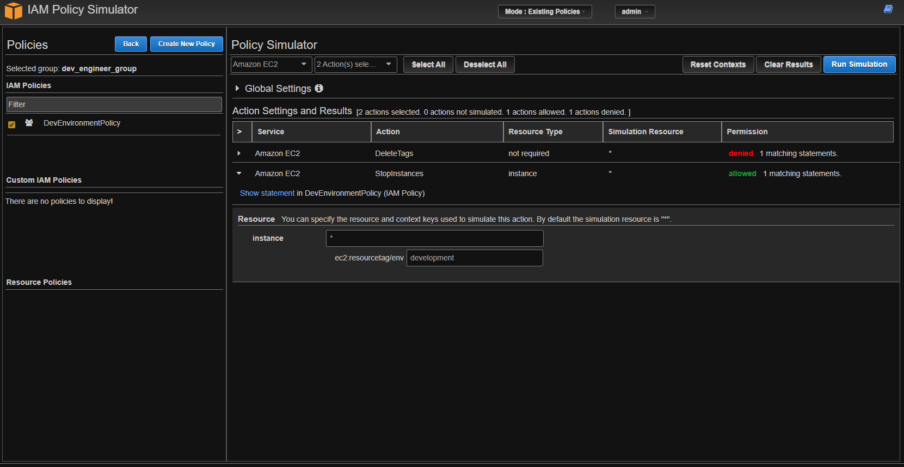
