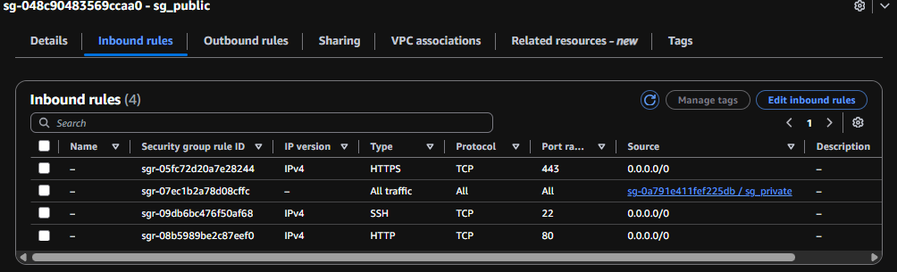
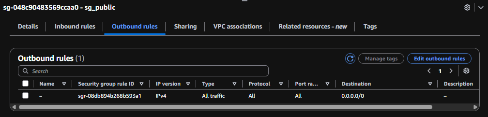
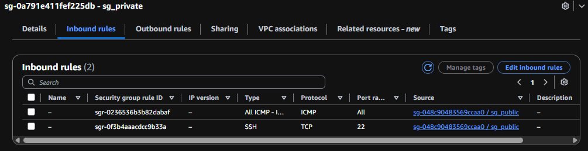
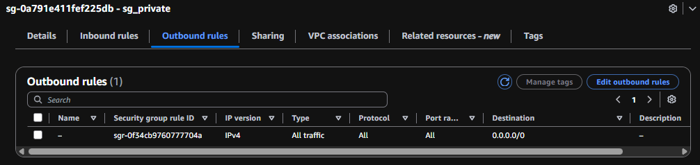
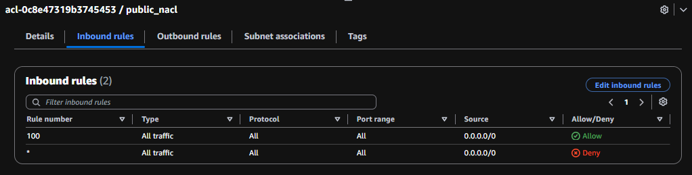
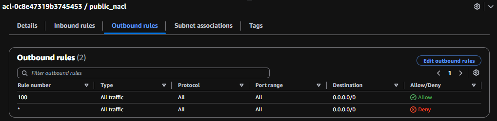
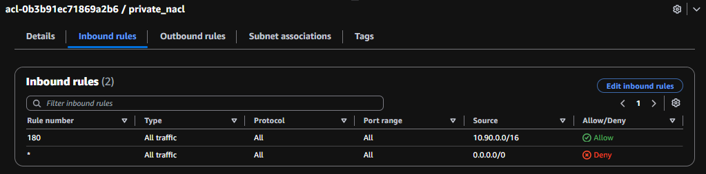
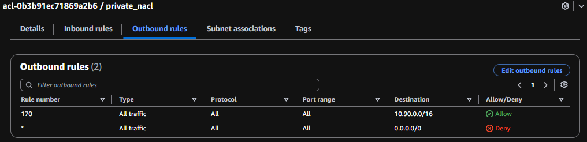

# Testing VPC Connectivity

## Project Overview

This project demonstrates the deployment of a secure and segmented AWS network environment using Infrastructure as Code (IaC) with Terraform.

The environment was deployed in the us-east-1 (N. Virginia) region using a custom VPC (10.90.0.0/16) containing separate public and private subnets. A public EC2 instance was placed in the public subnet with internet access through an Internet Gateway, while a private EC2 instance was deployed in an isolated private subnet without direct internet exposure.

Route tables, Security Groups, and Network ACLs were configured to control traffic flow and enforce layered security boundaries between resources. Terraform was used to automate infrastructure deployment and manage dependencies between AWS networking components.

This architecture demonstrates foundational cloud engineering concepts including network segmentation, defense-in-depth security, Infrastructure as Code, and reproducible cloud deployments.

## Problem this Project Solves

Businesses often need to separate internet-facing resources from internal systems to reduce attack surface and enforce security boundaries. This project demonstrates how Terraform can be used to deploy a segmented AWS network architecture that isolates private workloads while still allowing controlled communication between public and private resources.

## Project Objectives

- Deploy AWS infrastructure using Terraform.
- Create public and private subnets within a custom VPC.
- Configure routing between network components.
- Restrict access using Security Groups and NACLs.
- Launch EC2 instances in separate security zones.
- Validate connectivity and traffic flow between resources.

## Terraform Repository Structure

├── 00-auth.tf\
├── 01-vpc.tf\
├── 02-subnets.tf\
├── 03-igw.tf\
├── 04-rtb-groups.tf\
├── 05-sg.tf\
├── 06-nacl.tf\
├── 07-ec2.tf\
└── README.md

### Architecture Overview

This environment was deployed in the us-east-1 (N. Virginia) AWS region using a custom VPC with a CIDR range of 10.90.0.0/16.
The architecture was designed to demonstrate secure network segmentation by separating public-facing resources from internal resources.
This project intentionally uses a single Availability Zone to focus on network architecture concepts rather than high availability design patterns.

## Network Layout

| Resource       | CIDR          | Availability Zone | Purpose                         |
| -------------- | ------------- | ----------------- | ------------------------------- |
| VPC            | 10.90.0.0/16  | us-east-1         | Isolated network environment    |
| Public Subnet  | 10.90.1.0/24  | us-east-1a        | Hosts internet-facing resources |
| Private Subnet | 10.90.11.0/24 | us-east-1a        | Hosts internal resources        |

## Traffic Flow

1. Internet traffic enters the VPC through the Internet Gateway.

2. The Public Route Table contains a default route (`0.0.0.0/0`)
    pointing to the Internet Gateway.
3. The Public EC2 instance resides in the public subnet and receives
    internet access through this route.
4. The Private Route Table does not contain an Internet Gateway route,
    preventing direct internet connectivity.
5. The Private EC2 instance remains isolated inside the private subnet.
6. Security Groups provide stateful instance-level filtering while
    Network ACLs provide stateless subnet-level filtering.

## Technologies Used

### Cloud Services

- AWS VPC
- Subnet
- AWS IGW
- AWS RTBs
- AWS Security Groups
- AWS NACL
- Amazon EC2

#### Development and Operations Tools

- Git
- GitHub
- Visual Studio Code
- AWS Management Console

#### Networking Concepts

- CIDR Addressing
- Subnetting
- Routing
- Stateful Firewalls
- Stateless Firewalls
- Network Segmentation

#### Skills Demonstrated

- Designed and deployed a custom VPC using the 10.90.0.0/16 CIDR range.
- Implemented public and private subnets to enforce network isolation.
- Configured route tables and route associations to control traffic flow.
- Associated public and private subnets with dedicated route tables to enforce network traffic boundaries.
- Validated expected connectivity behavior using ICMP and HTTP testing between network segments.

#### Infrastructure as Code

- Terraform State Management
- Automated infrastructure deployment using Terraform.
- Managed resource dependencies between VPC components.
- Used version-controlled infrastructure definitions through Git and GitHub.

#### Security

- Implemented Security Groups as stateful firewalls.
- Configured Network ACLs as stateless subnet-level firewalls.
- Applied defense-in-depth security principles through multiple security layers.

#### Troubleshooting and Validation

- Verified Terraform deployments in the AWS Console.
- Validated route table associations and routing behavior.
- Confirmed Security Group ingress and egress rules.
- Verified Network ACL rule processing and subnet associations.
- Ensured EC2 instances were deployed into the correct subnets.
- Tested connectivity to confirm expected network behavior.

#### Documentation and Version Control

- Created technical documentation and architecture diagrams.
- Maintained project source code using Git version control.

## Networking Resources

**resource "aws_vpc" "us-east-1"** (Provides isolated network environment)

**resource "aws_subnet" "public_subnet"**(Hosts internet-facing resources)

**resource "aws_subnet" "private_subnet"**(Hosts internal resources)

**resource "aws_internet_gateway" "igw_us_east_1"**(Enables internet access for public resources)

**resource "aws_route_table" "public-rtb"**(Routes traffic to the internet)

**resource "aws_route_table" "private-rtb"**(Restricts internet access)

**resource "aws_route_table_association" "public_association"**(Associates a subnet with a route table, determining how traffic is routed for resources in that subnet)

**resource "aws_route_table_association" "private_association"**(Associates a subnet with a route table, determining how traffic is routed for resources in that subnet)

## Security Resources

**resource "aws_security_group" "sg_public"**(Stateful instance-level firewall)

**resource "aws_security_group" "sg_private"**(Stateful instance-level firewall)

**resource "aws_network_acl" "public_nacl"**(Stateless subnet-level firewall)

**resource "aws_network_acl" "private_nacl"**(Stateless subnet-level firewall)

## Compute Resources

**resource "aws_instance" "public_ec2"**(Used to validate connectivity)

**resource "aws_instance" "private_ec2"**(Used to validate connectivity)

## Security Group and NACL Rules

**public sg inbound rules**

**public sg outbound rules**

**private sg inbound rules**

**private sg outbound rules**

**public nacl inbound rules**

**public nacl outbound rules**

**private nacl inbound rules**

**private nacl outbound rules**

## VPC_Connections_Diagram

## Testing VPC Connectivity Screenshots

| Test                     | Expected Result | Outcome |
| ------------------------ | --------------- | ------- |
| Internet → Public EC2    | Success         | Passed  |
| Public EC2 → Internet    | Success         | Passed  |
| Public EC2 → Private EC2 | Success         | Passed  |
| Private EC2 → Internet   | Blocked         | Passed  |
| Internet → Private EC2   | Blocked         | Passed  |

**ec2 public instance_connect**\

**ec2 public terminal**\

**ec2 public and private connectivity ping_test**\

**ec2 public and internet connectivity curl_test**\

## End of Project Summary

This project demonstrated the ability to design, deploy, and validate a secure AWS network architecture using Terraform and Infrastructure as Code practices. The environment implemented network segmentation through the use of public and private subnets, route tables, Security Groups, and Network ACLs to control traffic flow and enforce defense-in-depth security principles.

By automating infrastructure deployment and validating expected connectivity behavior between network segments, this project showcased hands-on experience with AWS networking, Terraform, cloud security, infrastructure automation, and troubleshooting complex cloud environments.
